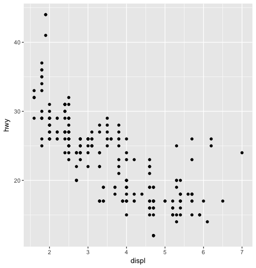

```mpg```

```
# A tibble: 234 x 11
   manufacturer model      displ  year   cyl trans      drv     cty   hwy fl    class  
   <chr>        <chr>      <dbl> <int> <int> <chr>      <chr> <int> <int> <chr> <chr>  
 1 audi         a4           1.8  1999     4 auto(l5)   f        18    29 p     compact
 2 audi         a4           1.8  1999     4 manual(m5) f        21    29 p     compact
 3 audi         a4           2    2008     4 manual(m6) f        20    31 p     compact
 4 audi         a4           2    2008     4 auto(av)   f        21    30 p     compact
 5 audi         a4           2.8  1999     6 auto(l5)   f        16    26 p     compact
 6 audi         a4           2.8  1999     6 manual(m5) f        18    26 p     compact
 7 audi         a4           3.1  2008     6 auto(av)   f        18    27 p     compact
 8 audi         a4 quattro   1.8  1999     4 manual(m5) 4        18    26 p     compact
 9 audi         a4 quattro   1.8  1999     4 auto(l5)   4        16    25 p     compact
10 audi         a4 quattro   2    2008     4 manual(m6) 4        20    28 p     compact
# ... with 224 more rows
```

```?mpg```

```ggplot(mpg) +                         
  geom_point(aes(x = displ, y = hwy))```
  


```ggplot(mpg) + 
  geom_point(aes(x = displ, y = hwy, color = class))```

```ggplot(mpg) + 
  geom_point(aes(x = displ, y = hwy, alpha = class))```

```ggplot(mpg) + 
  geom_point(aes(x = displ, y = hwy), color = 'blue')```
