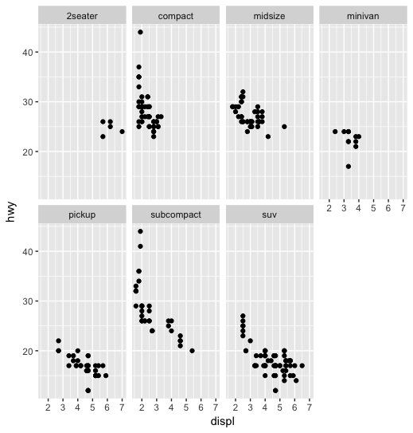
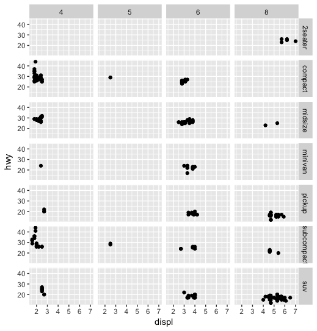

```R
# one way is to use label...
ggplot(mpg) +                         
  geom_point(aes(x = displ, y = hwy, color = class))
```


```R
# another way is to use facet!
ggplot(mpg) +                         
  geom_point(aes(x = displ, y = hwy)) +
  facet_wrap(~ class, nrow = 2) # ~ create a "formula" which facet_wrap requires
```



```R
# this facet gets complicated really quick, arrange it to grid for more than 1 class.
ggplot(mpg) +                         
  geom_point(aes(x = displ, y = hwy)) +
  facet_grid(class ~ cyl)
```

