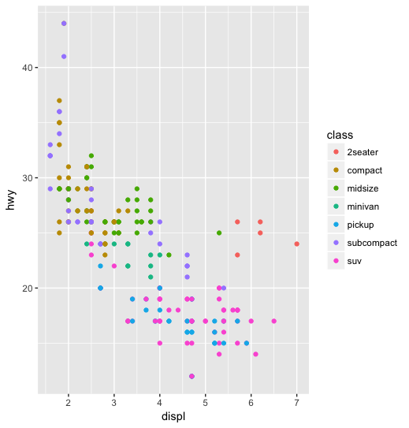
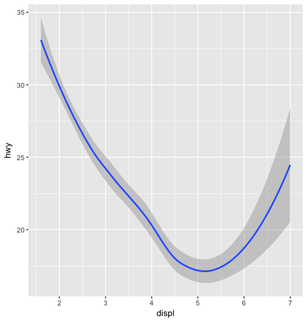
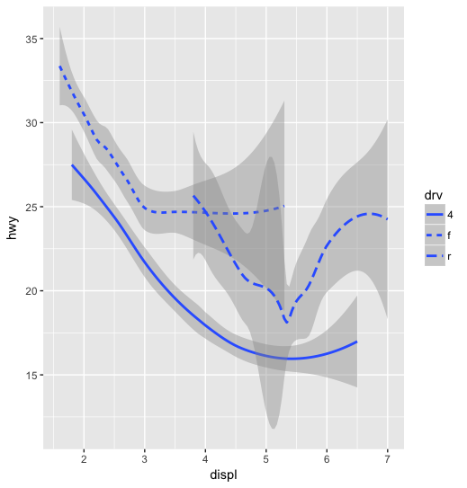
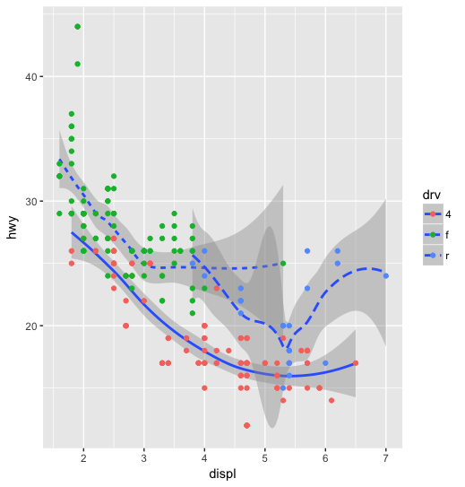
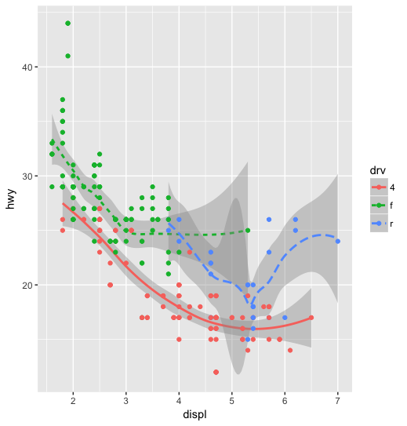
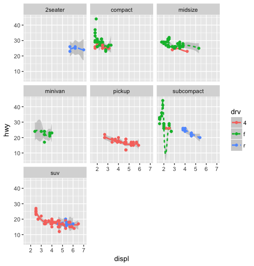

```R
# point wise
ggplot(mpg) +                         
  geom_point(aes(x = displ, y = hwy, color = class))
```



```R
# line wise with confident interval
ggplot(mpg) +                         
  geom_smooth(aes(x = displ, y = hwy))
```



```R
# separate them into categories
ggplot(mpg) +                         
  geom_smooth(aes(x = displ, y = hwy, linetype = drv))
```



```R
# maybe to be clearer, stack them with point
ggplot(mpg) +                         
  geom_smooth(aes(x = displ, y = hwy, linetype = drv)) + 
  geom_point(aes(x = displ, y = hwy, color = drv))
```



```R
# just a shorter way to put it, declare aes globally
ggplot(data = mpg, mapping = aes(x = displ, y = hwy, linetype = drv, color = drv) ) +                         
  geom_smooth() +
  geom_point()
```



```R
# or just...
ggplot(mpg, aes(x = displ, y = hwy, linetype = drv, color = drv)) +                         
  geom_smooth() +
  geom_point()
```


```R
# we can facet this ?
ggplot(mpg, aes(x = displ, y = hwy, linetype = drv, color = drv)) +                         
  geom_smooth() +
  geom_point() + facet_wrap(~class)
```


