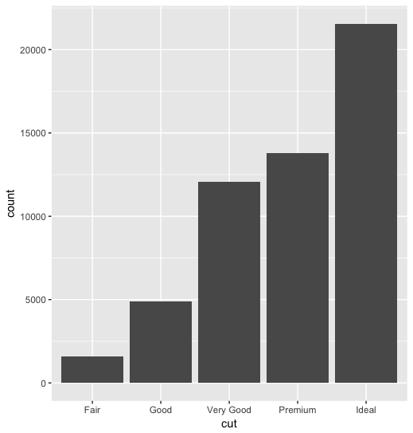
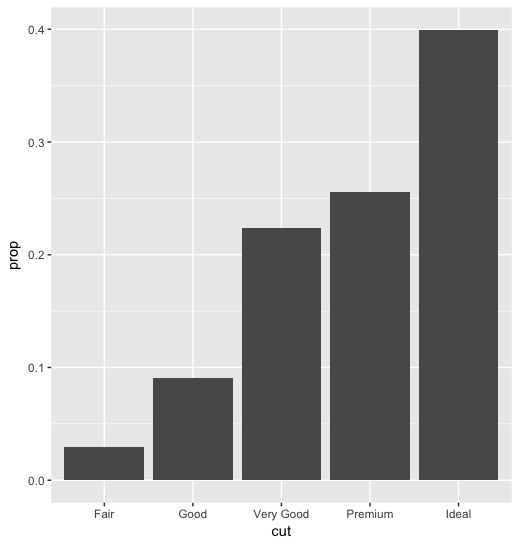
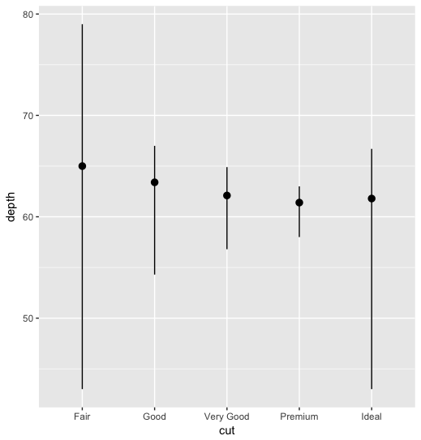
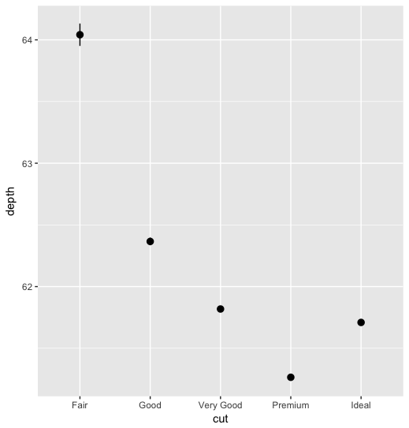

```R
# start with just counting anything with certain value "x"
ggplot(diamonds, aes(x = cut)) + 
  geom_bar()
```
  


```R
# stat_count is the same thing.
ggplot(diamonds, aes(x = cut)) + 
  stat_count()
```


```R
# convert count to proportion ? 
ggplot(diamonds, aes(x = cut, y = ..prop.., group = 1)) + 
  geom_bar()
```



```R
# "group" is to override the default group by each category, group = "anything" could work
# https://stackoverflow.com/questions/39878813/r-ggplot-geom-bar-meaning-of-aesgroup-1
# "..prop.." is special variables, very specific to ggplot 
# https://ggplot2.tidyverse.org/reference/geom_bar.html#computed-variables
ggplot(diamonds, aes(x = cut, y = ..count..)) + 
  geom_bar()
```


```R
ggplot(diamonds, aes(x = cut, y = ..prop.., group = "anything")) + 
  geom_bar()
```


```R
# stat_summary can be used to combine multiple y-values with the same x-values.
ggplot(diamonds, aes(x = cut, y=depth)) + 
  stat_summary(fun.ymin = min, fun.ymax = max, fun.y = median)
```



```R
# to use stderr for the error-bar, use mean_se for fun.data
ggplot(diamonds, aes(x = cut, y=depth)) +
  stat_summary(fun.data = mean_se)
```


