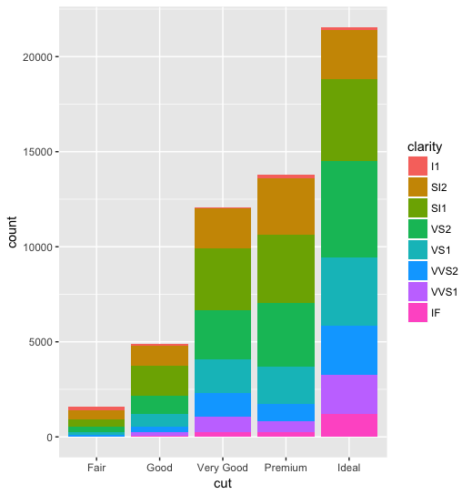
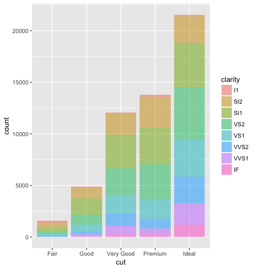
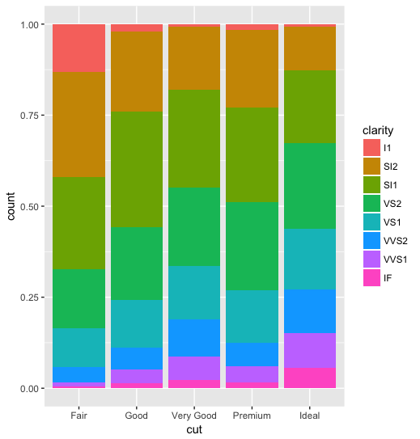
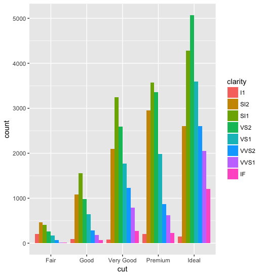
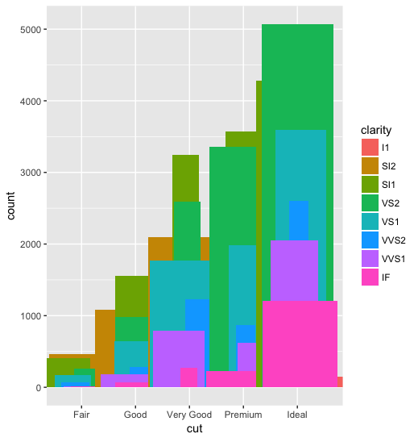
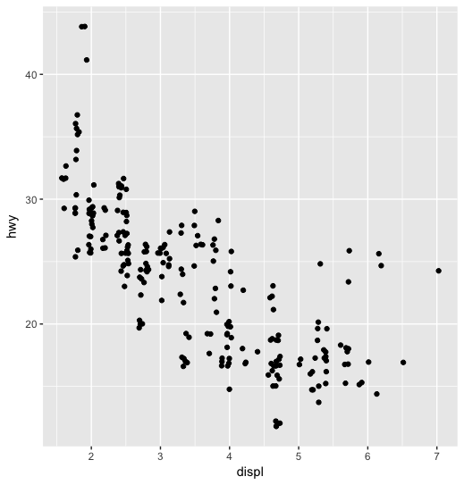

```R
# to fill the bar-chart with color, you have to use fill instead of color
# can fill according to certain category
ggplot(diamonds, aes(x = cut, fill = clarity)) + 
  geom_bar()
```



```R
# can use alpha for better looking .. really ?
ggplot(diamonds, aes(x = cut, fill = clarity)) + 
  geom_bar(alpha = 0.5)
```



```R
# ***super useful*** stack-bar with percentage can be done in a weird way.
ggplot(diamonds, aes(x = cut, fill = clarity)) +
  geom_bar(position = "fill")
```



```R
# somewhat less useful, but still used quite frequently, bar next to each other.
ggplot(diamonds, aes(x = cut, fill = clarity)) +
  geom_bar(position = "dodge")
```



```R
# do not just stack or put them next to each other, move them around..
ggplot(diamonds, aes(x = cut, fill = clarity)) +
  geom_bar(position = "jitter")
```



```R
# probably useful for other chart like scatter, point in the same position is distingiable.
ggplot(mpg, aes(x = displ, y = hwy)) +
  geom_point(position = "jitter")
```


