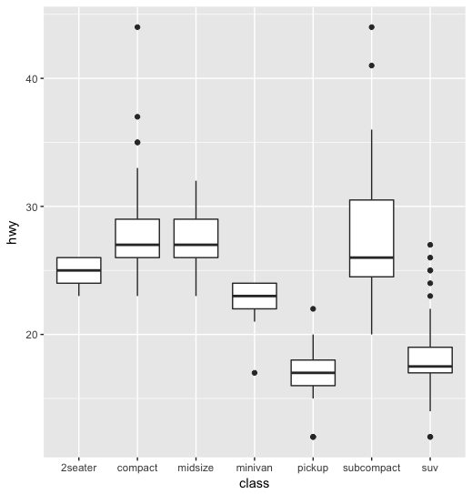
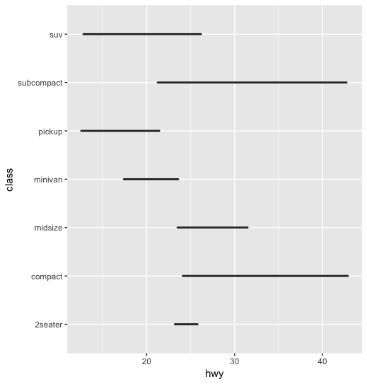
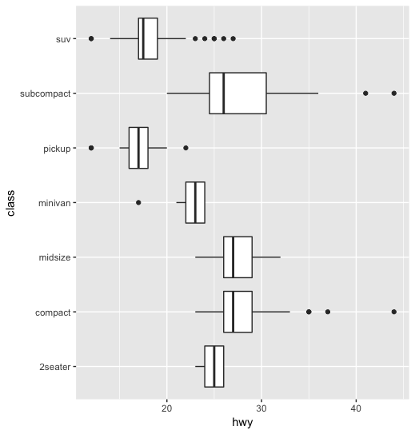
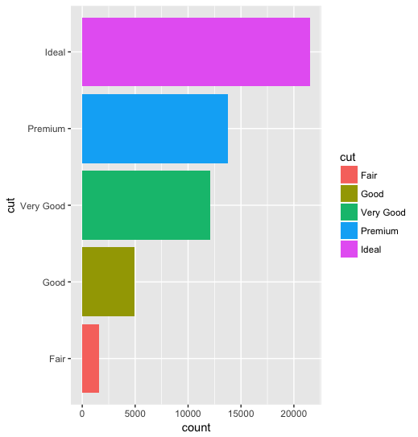
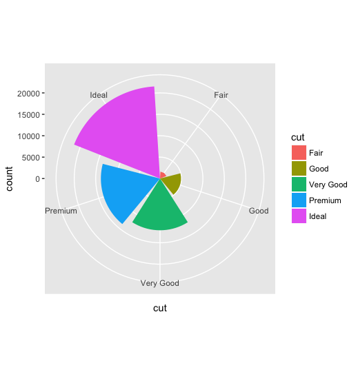

```R
# boxplot is one of the useful one!
ggplot(mpg, aes(x = class, y = hwy)) + 
  geom_boxplot()
```



```R
# you can flip the coordinate by x,y, but it's not so nice as box_plot does not understand
# always use x as the base to combine y.
ggplot(mpg, aes(y = class, x = hwy)) + 
geom_boxplot()
```



```R
# proper flip is as follows:
ggplot(mpg, aes(x = class, y = hwy)) + 
  geom_boxplot() + coord_flip()
```



```R
# assign variable like this:
diamonds_cut <- ggplot(diamonds, aes(x = cut, fill = cut))
bar <- diamons_cut + geom_bar()
# flip it
bar + coord_flip()
```



```R
# polar it
bar + coord_polar()
```


